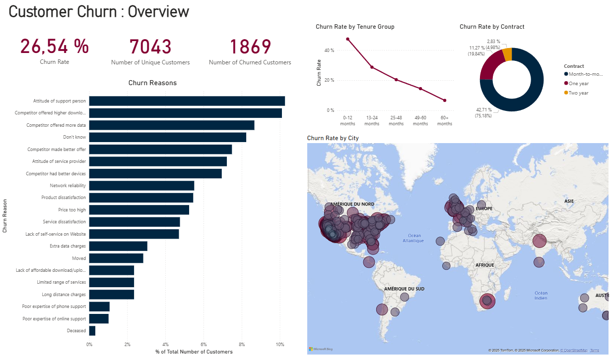
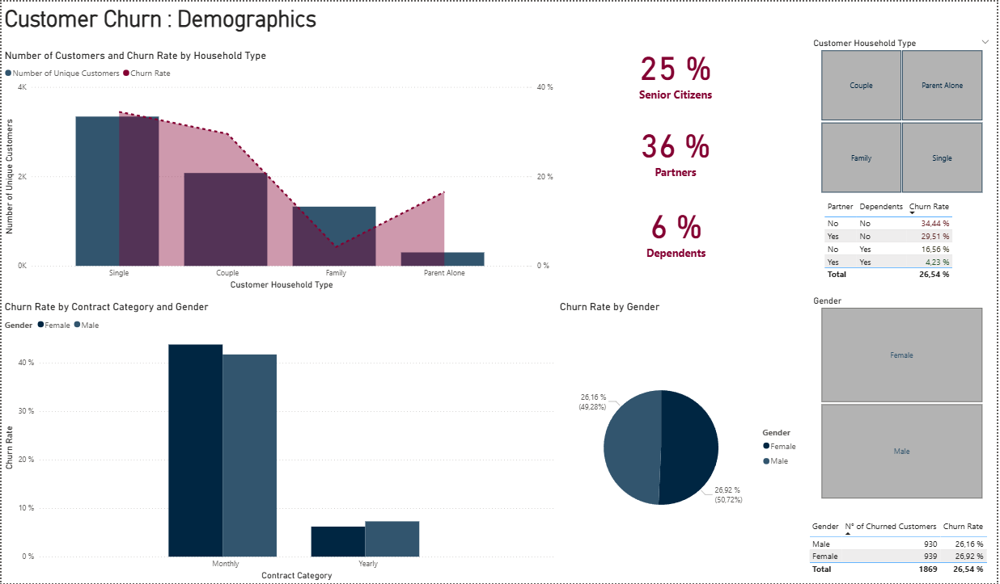
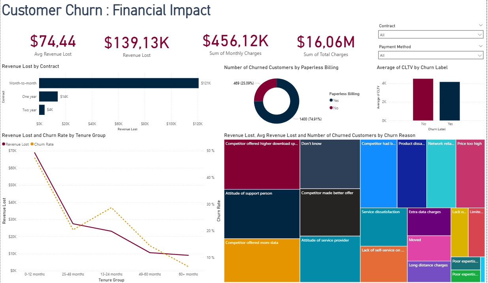
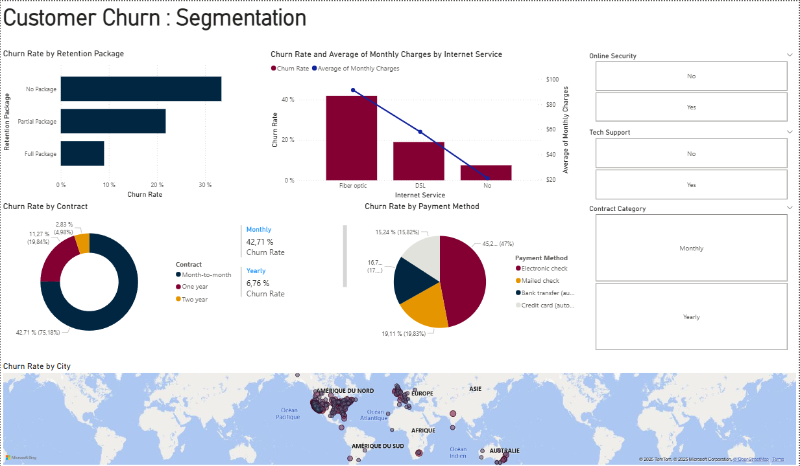

# 📊 Telecom Customer Churn Analysis Dashboard

## 📌 Project Overview
This Power BI project delivers a comprehensive, data-driven analysis of customer churn for a telecom company. It transforms raw customer data into actionable intelligence, moving beyond basic reporting to diagnose the root causes of churn and quantify its exact financial impact.

**Project Objectives:**
- Reduce Customer Acquisition Costs (CAC) by improving retention.
- Protect Recurring Revenue by identifying at-risk segments.
- Improve Service Offerings by understanding key dissatisfaction drivers.
- Make Strategic Decisions based on the cost of churn versus investment in retention.

---

## 🗂️ Dataset Source
The analysis is based on a public telecom customer churn dataset. The data was cleaned, transformed, and modeled in Power BI to build a robust analytical foundation.

**Kaggle Dataset Source:**  
[(https://www.kaggle.com/datasets/abdallahwagih/telco-customer-churn)]

---

## 🖥️ Dashboard Insights

### 1. Overview Dashboard
Provides an executive summary of churn, highlighting critical metrics and primary reasons for customer departure.

**Key Insights:**
- **Critical Churn Rate:** 26.54% churn; 1,869 customers left, posing a major threat to revenue.
- **Top Churn Reasons:** Competitive offers (speed/data) and support attitude are the main drivers.
- **High-Risk Tenure:** 0–12 month customers churn at >40%, indicating onboarding/service issues.
- **Contract Shield:** Month-to-Month contracts have much higher churn than annual contracts—commitment is a key retention factor.

---

### 2. Demographics Dashboard
Segments the customer base by demographics to pinpoint high-risk profiles.

**Key Insights:**
- **Household Risk:** Singles and Parents Alone churn more than Couples/Families—pricing may need optimization.
- **Customer Composition:** 25% Senior Citizens, 36% Partners—requires tailored communications.
- **Gender Analysis:** Gender-based churn rates can inform retention messaging.

---

### 3. Financial Impact Dashboard
Translates churn into financial loss, answering “How much is churn costing us?”

**Key Insights:**
- **Revenue Loss:** $16.06 Million annual revenue lost due to churn.
- **Contract Value:** Month-to-Month contracts have highest churn and lost revenue; Two-Year contracts are most stable.
- **High-Value Loss:** Customers in the 19–24 month tenure bracket cost over $570K—losing established customers is costly.
- **Paperless Billing Paradox:** 24% churn for paperless billing customers vs. 8% for others.

---

### 4. Customer Segmentation Dashboard
Provides a granular view of churn by segmenting customers based on service subscriptions, payment methods, contract details, tenure, and geography. This dashboard identifies at-risk pockets and key retention opportunities.

**Key Insights:**

- **Service Type Analysis**
  - **Fiber Optic Vulnerability:** Customers with Fiber Optic Internet churn at >40%, despite premium status—potential issues with reliability, pricing, or performance expectations.
  - **Bundle Benefits:** Customers with multiple services (Internet + Phone + TV) have significantly lower churn; bundling increases customer stickiness.

- **Payment Method**
  - **Electronic Check = High Risk:** Churn rate ~45%; these customers may be less digitally engaged or more sensitive to manual payments.
  - **Auto-Pay = Retention:** Automatic payment methods (credit card, bank transfer) correlate with much lower churn, emphasizing convenience.

- **Contract & Tenure**
  - **The Power of Commitment:** Month-to-Month contracts are the highest-risk group (42.71% churn); Two-Year contracts have a very low churn rate (2.83%), proving long-term commitments are stabilizing.
  - **Tenure Tiers:** Customers beyond 24 months enter a “stable” phase with drastically reduced churn.

- **Geographic Clusters**
  - Mapping reveals regional churn hotspots, linked to local market competition, network quality, or effectiveness of support teams.

---

## 📈 Business Impact & Strategic Recommendations

- **Quantified Opportunity:** With $16.06M annual revenue lost, reducing churn by 10% (~187 customers) could save ~$1.6 Million.
- **Strategic Shift:** Move from reactive churn tracking to proactive prevention.

**Actionable Recommendations:**
- Revamp onboarding to address >40% first-year churn.
- Promote migration to long-term contracts with incentives.
- Develop segmented retention offers for high-risk demographics and churn reasons.
- Invest in support training focused on empathy and customer care.
- **Promote Auto-Pay & Paperless:** Campaigns to migrate customers from Electronic Check to Automatic Payment, incentivizing enrollment for long-term loyalty.
---

## 🛠️ Tools & Technologies
- **Microsoft Power BI:** Visualization, reporting, and DAX calculations.
- **Power Query:** ETL (data extraction, transformation, and loading).
- **DAX:** Calculated columns, measures, and advanced analytics.
- **Kaggle:** Source of telecom churn dataset.

---

## 🚀 Conclusion
This dashboard suite equips the telecom company to launch effective, data-driven retention strategies. By understanding who is churning, why, and the financial impact, the business can allocate resources to reduce churn, protect profits, and foster sustainable growth.
